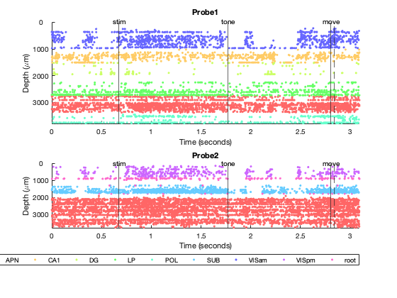
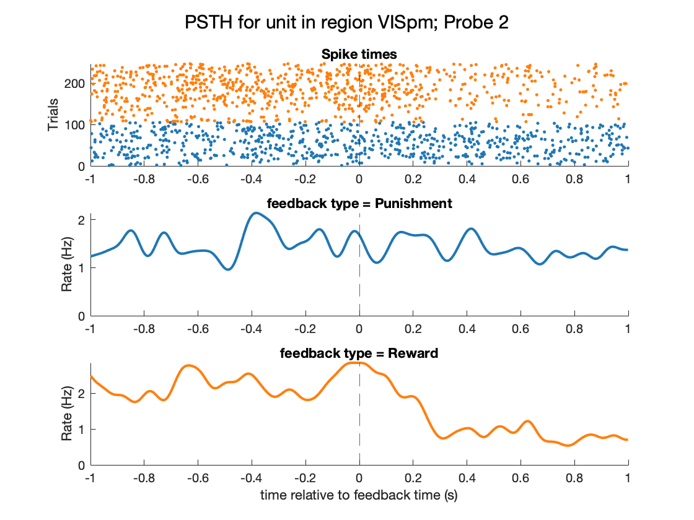

# distributed-coding-demo

This repo contains MATLAB live scripts for interactive visualization of data from Steinmetz et al., (2019): [Distributed coding of choice, action and engagement across the mouse brain](https://www.nature.com/articles/s41586-019-1787-x). These data contain electrophysiological recordings of neuronal activity across the mouse brain while the animals are engaged in a perceptual decision-making task. Data is aggregated across multiple [Neuropixel probes](https://www.ucl.ac.uk/neuropixels/) inserted at various brain locations across multiple animals.

Joint project with Mathworks

## Setup

* [Download MatNWB](https://github.com/NeurodataWithoutBorders/matnwb) and add to MATLAB search path.

* [Download distributed-coding-matnwb repo](https://github.com/catalystneuro/distributed-coding-matnwb) and add to MATLAB search path.

* Download NWB dandi-set [here](https://dandiarchive.org/dandiset/000017/draft).

## Exploring trial-specific responses of all neurons recorded within a session 

**Live script:** single_neuron_all_trials_demo.mlx

**Sample plot:** 

## Exploring neuron-specific responses to all trials recorded within a session 

**Live script:**  single_trial_all_units_demo.mlx

**Sample plot:** 

